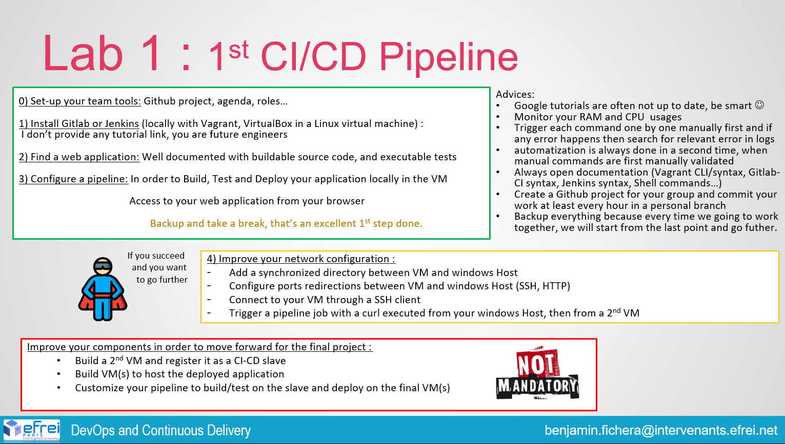
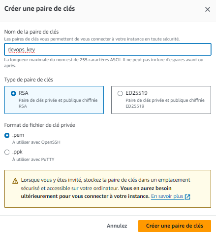
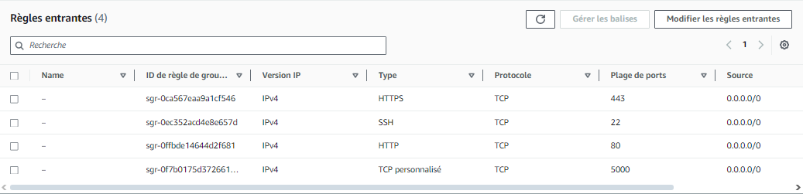

# Lab 1 - Gitlab pipeline



## Objectives

- [x] Setup your team tools
- [x] Install Gitlab (with docker)
- [ ] Find a web application
- [ ] Configure a pipeline
- [ ] Improve your network configuration
  - [x] Add synchronized directories between the host and the VM
  - [x] Configure port forwarding (ssh, http)
  - [x] Connect to the VM with ssh client
  - [ ] Trigger a pipeline with a curl from host and a second VM
- [ ] Improve yout components in order to move forward
  - [ ] Build a second docker and register as a runner
  - [ ] Build a VM to deploy the app
  - [ ] Customize your pipeline to build/test on the runner and deploy on the final VM

## Installation

### Configuration

Start VM

```bash
cd lab1
vagrant up
vagrant ssh
```

Start gitlab and gitlab-runner with docker compose

```bash
cd /vagrant_data
sudo docker compose up
```

Wait for the gitlab to boot on <http://localhost:8080/>

Login into gitlab with ```root``` and the password given by the following command

```bash
sudo docker exec -it gitlab grep 'Password:' /etc/gitlab/initial_root_password
```

In the gitlab UI, change the password of the root user and create a new repository for example "test-app".

=======================================================================

Retournez sur votre VM vagrant et crée un réseau docker "gitlab_runner"
Puis dans le fichier /etc/hosts rajoutez la ligne : "10.0.2.15 gitlab.example.com"

Ensuite allez dans le dossier du projet python et exécutez les commandes suivantes :

git remote set-url origin http://gitlab.example.com/root/devops_project.git
git push --all origin

=======================================================================

Après crée les trois runners suivants :

docker exec -it gitlab-runner gitlab-runner register \
  --non-interactive \
  --url http://gitlab.example.com \
  --registration-token DzmBihnXFQzP9wu4m6if \
  --tag-list "pythonapp" \
  --executor docker \
  --docker-image python:3.9-slim-buster \
  --docker-network-mode gitlab_default

docker exec -it gitlab-runner gitlab-runner register \
  --url http://gitlab.example.com \   
  --registration-token DzmBihnXFQzP9wu4m6if \   
  --tag-list "dockerapp" \   
  --executor docker \   
  --docker-image docker:26.1 \   
  --docker-network-mode gitlab_default \ 
  --docker-privileged true \ 
  --docker-volumes "/certs/client" \

docker exec -it gitlab-runner gitlab-runner register \
  --url http://gitlab.example.com \   
  --registration-token DzmBihnXFQzP9wu4m6if \   
  --tag-list "shellapp" \   
  --executor shell \
  --docker-network-mode gitlab_default \

Remplacez {token} par votre propre token runner. Pour le trouver allez dans "Admin area" cliquez ensuite sur "Instances runner", cliquez sur les trois petits point
et copiez votre token.

=======================================================================

Il va falloir que vous créez une VM EC2 dans AWS pour déployer l'application web.
- Créez-vous un compte si ce n'est pas déjà fait
- Allez dans EC2 et créez une instance
- Choisissez pour OS Ubuntu
- Puis créez la clé de sécurité suivante
  
- Dans votre groupe de sécurité rajoutez les régles suivantes
  

=======================================================================

Ensuite dans votre gitlab il faudra aller dans les settings de votre CI/CD puis dans "Variables" et rajoutez les variables :
  - REGISTRY_PASS dans laquelle vous mettrez votre mot de passe de votre Docker Hub
  - REGISTRY_USER dans laquelle vous mettrez votre nom d'utilisateur de votre Docker Hub
  - SSH_PRIVATE_KEY dans laquelle vous mettrez votre clé ssh de votre VM EC2

=======================================================================

Enfin allez dans votre projet gitlab "devops_project" et créez un fichier .gitlab-ci.yml et ajoutez-y le contenu suivant et remplacez {DNS public} par le DNS public de votre EC2 :

variables:
    IMAGE_NAME: julesdavoust/devops_project
    IMAGE_TAG: pythonapp-1.1

stages:
    - test
    - build
    - deploy

run_test:
    stage: test
    tags:
        - pythonapp
    before_script:
        - apt-get update && apt-get install -y make
    script:
        - make test

build_image:
    stage: build
    services:
        - name: docker:26.1-dind
          alias: docker
    tags:
        - dockerapp
    variables:
        DOCKER_HOST: tcp://docker:2375
        DOCKER_TLS_CERTDIR: ""
    before_script:
        - docker info
        - echo "$REGISTRY_PASS" | docker login --username "$REGISTRY_USER" --password-stdin
    script:
        - docker build . -t $IMAGE_NAME:$IMAGE_TAG
        - docker push $IMAGE_NAME:$IMAGE_TAG

deploy:
    stage: deploy
    tags:
        - shellapp
    script:
        - cp "$SSH_PRIVATE_KEY" ~/.ssh/id_rsa 
        - chmod 600 ~/.ssh/id_rsa
        - ssh-keyscan -H ec2-13-36-37-239.eu-west-3.compute.amazonaws.com >> ~/.ssh/known_hosts
        - chmod 644 ~/.ssh/known_hosts
        - ssh -o StrictHostKeyChecking=no -i ~/.ssh/id_rsa ubuntu@{DNS public} "
          sudo apt-get update &&
          sudo apt-get install -y docker.io &&
          sudo echo $REGISTRY_USER && echo $REGISTRY_PASS &&
          echo $REGISTRY_PASS | sudo docker login -u $REGISTRY_USER --password-stdin &&
          sudo docker ps -aq | xargs -r sudo docker stop &&
          sudo docker ps -aq | xargs -r sudo docker rm &&
          sudo docker run -d -p 5000:5000 $IMAGE_NAME:$IMAGE_TAG"

=======================================================================


Quand votre pipeline aura fini de s'exécuter connectez vous : {adresse IPv4 public de la VM EC2}:5000

***The configuration steps need to be done once since you don't destroy the VM***
